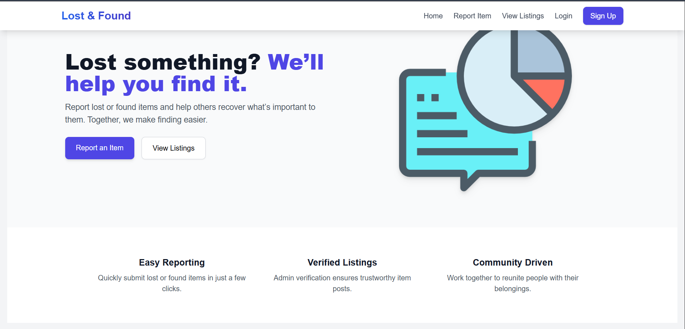
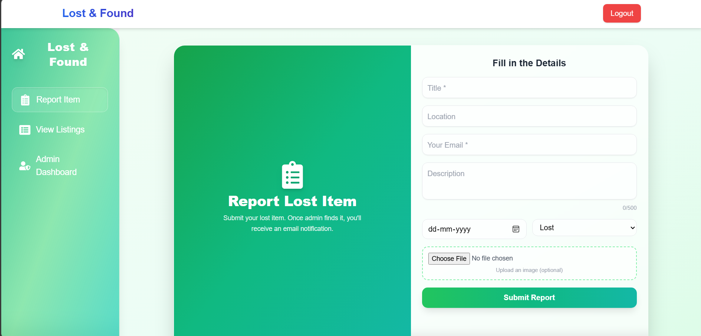
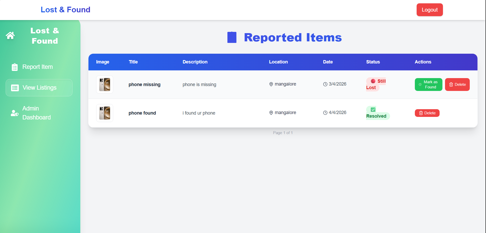
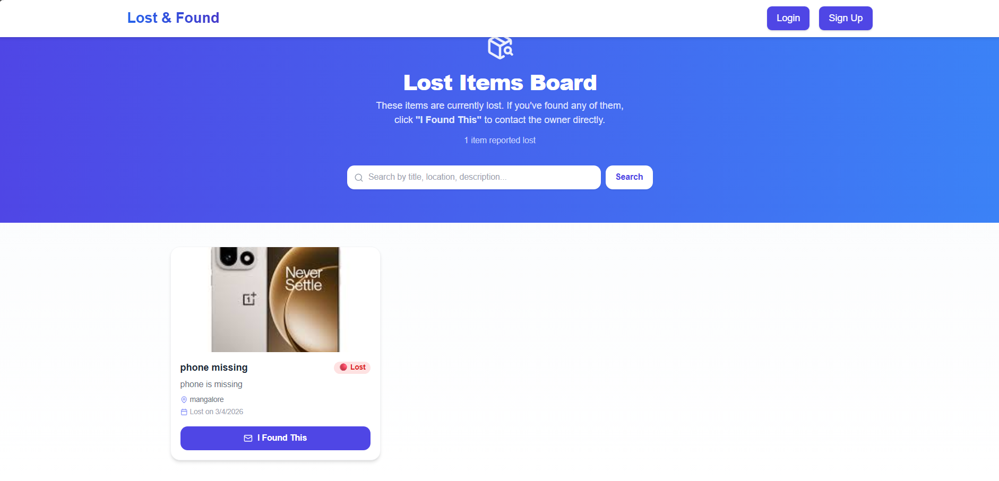
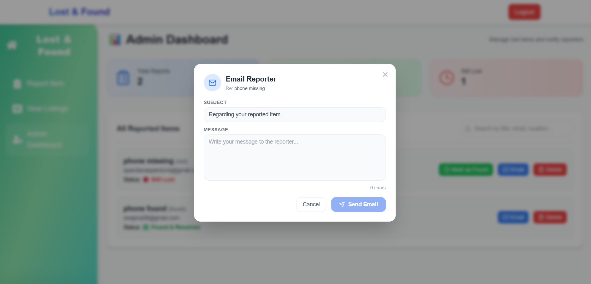
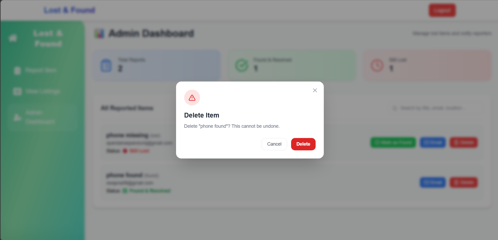
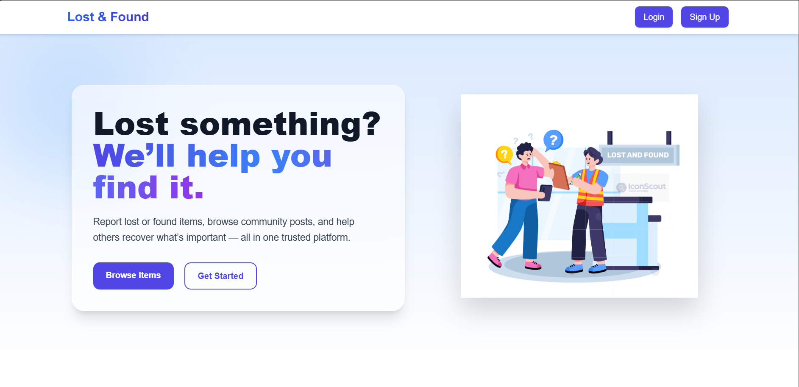

# 🔍 Lost & Found — Full Stack Web Application

A full-stack platform to report, browse, and recover lost items. Users report lost items with images, admins verify and manage listings, and email notifications keep reporters updated when their item is found.

---

## 🚀 Live Demo

> **Live-demo:**(https://lost-found-gilt.vercel.app/)  


---


## Screenshots

### Home Page


### Report Item form


### view listings


### browse item page



### email page



### delete page


### Admin Dashboard


🎬 **Project Demo**


[](https://drive.google.com/file/d/1jDRb05lc4UvxENWh-Vo5EIJpdgfgoG-d/view?usp=sharing)

---

## 🛠 Tech Stack

### Frontend
- React 18
- Tailwind CSS
- Framer Motion (animations)
- Axios (API calls)
- React Router DOM
- Lucide React (icons)
- React Toastify (notifications)

### Backend
- Node.js + Express.js
- MongoDB + Mongoose
- JWT Authentication (httpOnly cookies)
- Multer + Cloudinary (image upload)
- Nodemailer + Gmail (email notifications)
- express-validator (input validation)
- Helmet (security headers)
- express-rate-limit (brute force protection)
- Morgan (request logging)
- cookie-parser

---

## ✨ Features

### User Features
- Signup and login with secure authentication
- Report lost items with title, description, location, date, and image
- View all your reported items with current status
- Receive email notification when admin marks your item as found

### Public Features (No Login Required)
- Browse all currently lost items
- Search by title, location, or description
- Click **"I Found This"** to contact the reporter directly via email

### Admin Features
- View all reported items across all users
- Search and filter reports
- Mark items as **Found** (automatically sends email to reporter)
- Delete inappropriate or resolved reports
- Send custom emails to any reporter
- Dashboard with stats — Total Reports, Found & Resolved, Still Lost

---

## 🔐 Security

- **httpOnly Cookies** — JWT token stored in httpOnly cookie, invisible to JavaScript, prevents XSS token theft
- **Helmet.js** — Sets secure HTTP response headers automatically
- **Rate Limiting** — Login endpoint limited to 10 attempts per 15 minutes (brute force protection)
- **express-validator** — All user input validated and sanitized on the server side
- **Role-based Access Control** — Every admin route checks `req.user.role === "admin"` server-side
- **CORS** — Configured to only allow requests from the frontend origin with credentials

---

## 📁 Project Structure

```
lost-and-found/
│
├── client/                        # React Frontend
│   ├── public/
│   └── src/
│       ├── assets/                # Images
│       ├── components/
│       │   ├── Navbar.jsx
│       │   ├── Sidebar.jsx
│       │   ├── ProtectedRoute.jsx
│       │   ├── ConfirmModal.jsx
│       │   └── EmailModal.jsx
│       ├── pages/
│       │   ├── Home.jsx
│       │   ├── Login.jsx
│       │   ├── SignUp.jsx
│       │   ├── ReportForm.jsx
│       │   ├── Listings.jsx
│       │   ├── PublicList.jsx
│       │   ├── AdminDashboard.jsx
│       │   └── NotFound.jsx
│       ├── utils/
│       │   └── api.js             # Axios instance with interceptors
│       └── App.jsx
│
└── server/                        # Express Backend
    ├── config/
    │   └── db.js                  # MongoDB connection
    ├── middleware/
    │   └── auth.js                # JWT cookie verification
    ├── models/
    │   ├── User.js
    │   └── Item.js
    ├── routes/
    │   ├── auth.js                # Signup, Login, Logout, /me
    │   ├── items.js               # CRUD + public route
    │   └── admin.js               # Admin actions + email
    ├── utils/
    │   ├── cloudinary.js
    │   └── mailer.js
    └── server.js
```

---

## ⚙️ Local Setup

### Prerequisites
- Node.js v18+
- MongoDB Atlas account (free tier)
- Cloudinary account (free tier)
- Gmail account with App Password

### 1. Clone the repository
```bash
git clone https://github.com/Spandana-MJ/lost-and-found.git
cd lost-and-found
```

### 2. Backend setup
```bash
cd server
npm install
cp .env.example .env
# Fill in your values in .env
npm run dev
```

### 3. Frontend setup
```bash
cd client
npm install
cp .env.example .env
# Add: VITE_API_URL=http://localhost:5000
npm run dev
```

---

## 🔑 Environment Variables

### server/.env
```env
MONGO_URI=mongodb+srv://<user>:<password>@cluster.mongodb.net/lost-found
JWT_SECRET=your_strong_secret_key
PORT=5000
CLIENT_URL=http://localhost:5173
EMAIL_USER=yourgmail@gmail.com
EMAIL_PASS=your_16_char_app_password
CLOUDINARY_CLOUD_NAME=your_cloud_name
CLOUDINARY_API_KEY=your_api_key
CLOUDINARY_API_SECRET=your_api_secret
NODE_ENV=development
```

### client/.env
```env
VITE_API_URL=http://localhost:5000
```

> ⚠️ `EMAIL_PASS` must be a **Gmail App Password** — not your real Gmail password.  
> Generate one at: https://myaccount.google.com/apppasswords  
> (Requires 2-Step Verification to be enabled)

---

## 🚀 Deployment

### Backend → Render.com
1. Push code to GitHub
2. Go to [render.com](https://render.com) → New Web Service
3. Connect your GitHub repo → select `server` folder
4. **Build command:** `npm install`
5. **Start command:** `node server.js`
6. Add all environment variables from `server/.env`
7. Set `NODE_ENV=production`
8. Copy the Render URL for frontend env

### Frontend → Vercel
1. Go to [vercel.com](https://vercel.com) → New Project
2. Connect GitHub repo → select `client` folder
3. Add environment variable: `VITE_API_URL=https://your-render-url.onrender.com`
4. Deploy

> ⚠️ After deploying, update `CLIENT_URL` in your Render environment variables to your Vercel URL.

---

## 🔄 How It Works

```
1. User signs up and logs in
         ↓
2. User reports a lost item (title, description, location, image)
         ↓
3. Item appears on public Browse page as "🔴 Still Lost"
         ↓
4. Visitor finds the item → clicks "I Found This" → emails reporter directly
         ↓
5. Admin receives the found item → clicks "Mark as Found" in dashboard
         ↓
6. Reporter receives email: "Your item has been found!"
         ↓
7. Item disappears from Browse page (marked as resolved)
```

---

## 🧩 API Endpoints

### Auth
| Method | Endpoint | Description | Auth |
|--------|----------|-------------|------|
| POST | `/api/auth/signup` | Register new user | Public |
| POST | `/api/auth/login` | Login (sets httpOnly cookie) | Public |
| POST | `/api/auth/logout` | Logout (clears cookie) | Public |
| GET | `/api/auth/me` | Get logged-in user | Required |

### Items
| Method | Endpoint | Description | Auth |
|--------|----------|-------------|------|
| GET | `/api/items/public` | Browse lost items | Public |
| GET | `/api/items` | Get items (own/all for admin) | Required |
| POST | `/api/items` | Report new item | Required |
| PUT | `/api/items/:id/verify` | Mark as found | Admin |
| DELETE | `/api/items/:id` | Delete item | Required |

### Admin
| Method | Endpoint | Description | Auth |
|--------|----------|-------------|------|
| GET | `/api/items/stats` | Dashboard stats | Admin |
| POST | `/api/admin/send-email/:id` | Email reporter | Admin |


---

## 🔮 Future Improvements

- Refresh tokens for persistent sessions
- Socket.io for real-time notifications when item is found
- Image moderation using Cloudinary AI
- SMS notifications via Twilio
- Map view showing where items were lost
- Mobile app using React Native

---

## 👩‍💻 Author

**Spandana MJ**

[](https://github.com/Spandana-MJ)
[](https://linkedin.com/in/spandana-mj)
[](https://my-portfolio-alpha-one-48.vercel.app)

---

## 📄 License

MIT License — feel free to use this project for learning or portfolio purposes.
