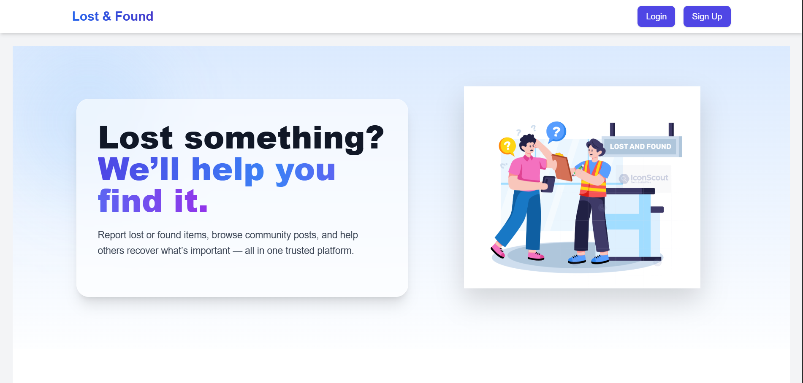
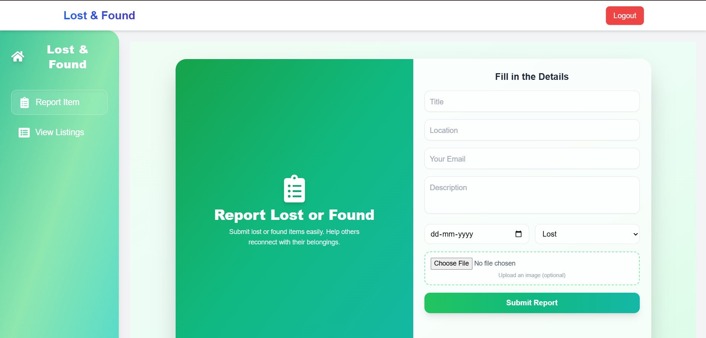
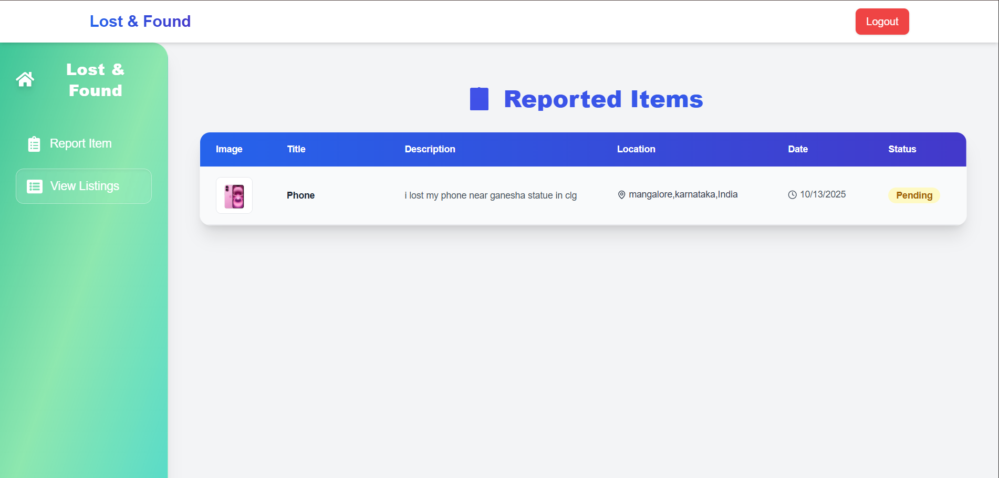
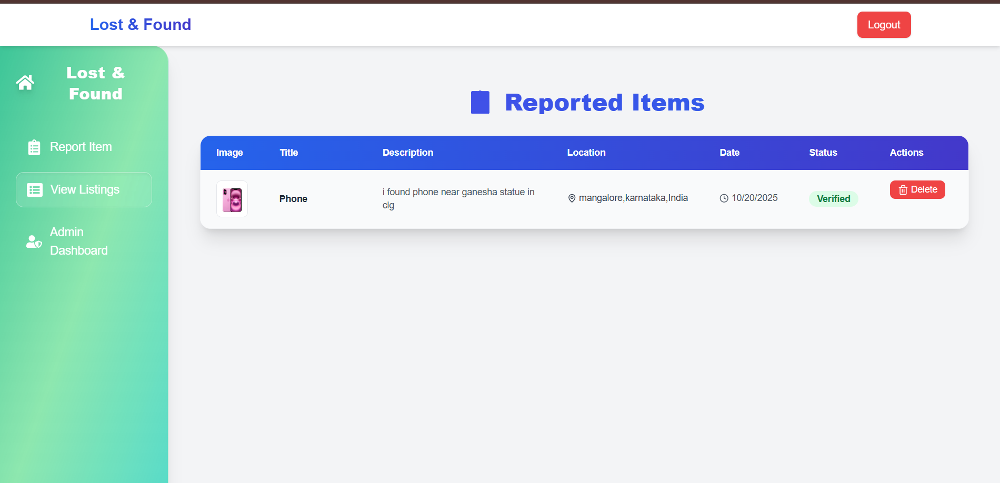
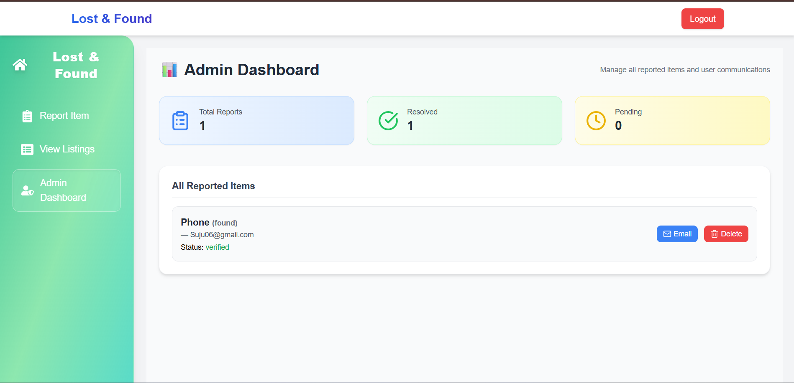

# Lost & Found MERN Project

A web application to report and manage lost and found items. Users can report items, and admins can verify, match, and notify owners via email.  

---
## Features

### User
- Sign up and login
- Report lost or found items
- View only their own items

### Admin
- Login directly
- View all reported items
- Verify and match lost & found items
- Send email notifications to users
- Dashboard displays:
  - Total reports
  - Resolved
  - Pending
- Delete items if necessary

### File Uploads
- Users can upload images of items using Multer
- Admin can view uploaded images

---
## Tech Stack
- **Frontend:** React, Vite, TailwindCSS  
- **Backend:** Node.js, Express  
- **Database:** MongoDB  
- **Authentication:** JWT  
- **Email:** SMTP  

---

## Screenshots

### Home Page


### Sign up page


### login page


### Report Item Form



### user Listings



### Admin view listings


### Admin Dashboard



## Setup Instructions

1. Clone the repository:
```bash
git clone https://github.com/<your-username>/lost-found.git
cd lost-found


Install dependencies:


# Server
cd server
npm install

# Client
cd ../client
npm install

Start the development server:


# Server
cd server
nodemon server.js

# Client
cd ../client
npm run dev
Open http://localhost:5173 in your browser.

```


🎬 **Project Demo**

[](https://drive.google.com/file/d/1ywxdusUf0LhL1RfEeBKUj-UMS70JCM5-/preview)

